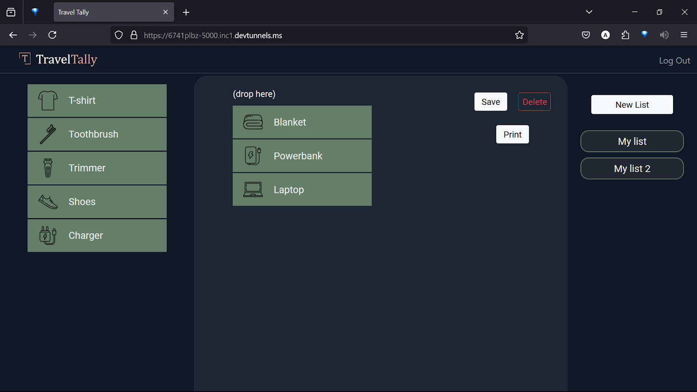
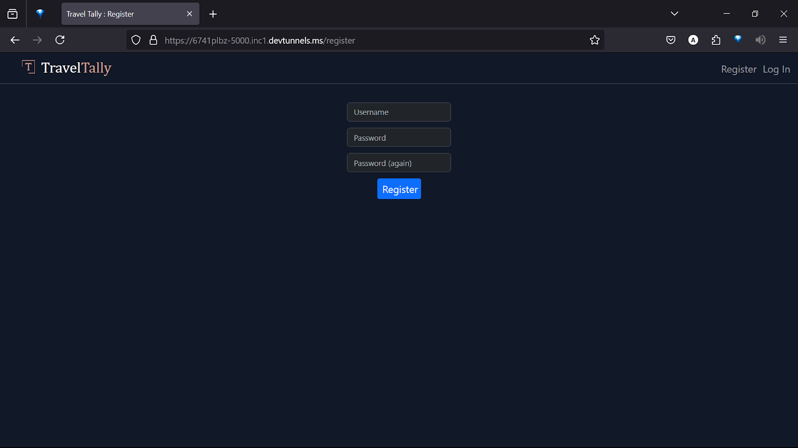
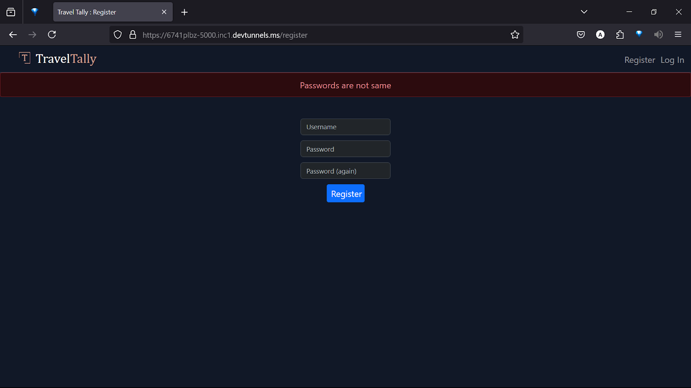
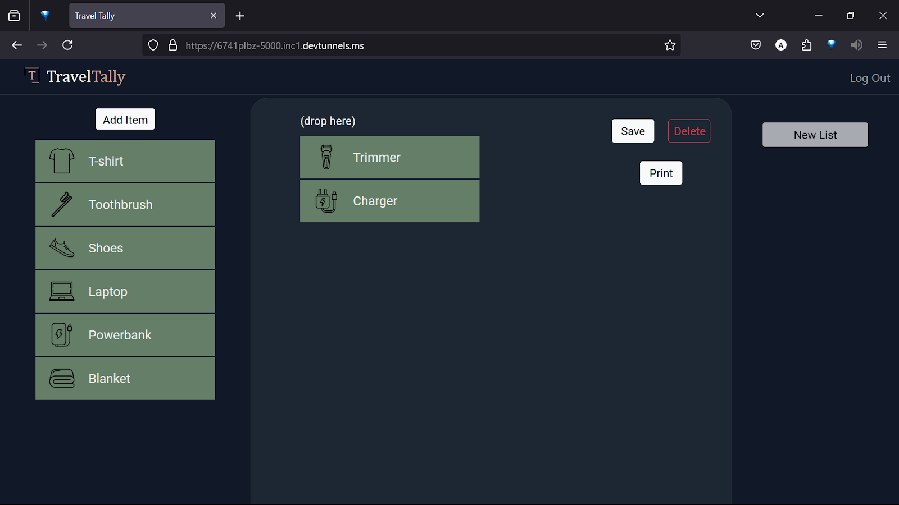
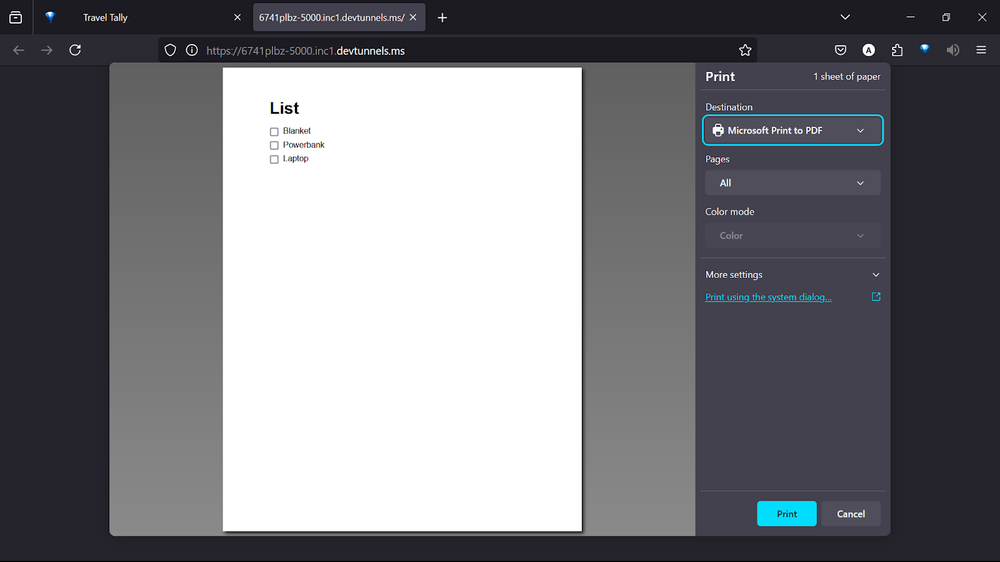

# TravelTally

#### Description:

A website that can make lists by dragging and dropping items, and save them for future use

## Table of Contents

- [General Info](#general-information)
- [Technologies Used](#technologies-used)
- [Features](#features)
- [Screenshots](#screenshots)
- [Setup and Usage](#setup-and-usage)
- [Make-up of Program](#make-up-of-program)
- [Design Choices](#design-choices)
- [Acknowledgements](#acknowledgements)
- [Contact](#contact)

## Introduction

This web application allows you to make a travel checklist, which consists of a list of items you want to carry on a trip. You can do so by simply dragging and dropping items from a sidebar. Once you’re finished with your list, you can save it for future use. Additionally you have the option to print the list or save it as a PDF if you prefer a physical copy.

## Technologies Used

- Python - version 3.11.2
- Flask
- SQLite db (sqlite3)
- HTML, CSS, Javascript
- JQuery (little bit)
- Jinja
- Bootstrap

## Features

- You can drag and drop items to make your list, and you can remove items by dragging them back to the sidebar.
- You can save your list with a name, which appears on the right side
- When you click on any one of the list names, it opens up that list for view and edit (Editing is not currently implemented)
- Click the 'Print' button to generate a specially formatted checklist
- Each item in the sidebar comes with an icon for better user experience.
- Users have to log in with username and password for **privacy**.

## Screenshots

  
More images

  <figure>
    
    <figcaption style="text-align:center;">Fig.1 - Register</figcaption>
     
  </figure>
  
  <figure>
    
    <figcaption style="text-align:center;">Fig.2 - Error</figcaption>
     
  </figure>
  
  <figure>
    
    <figcaption style="text-align:center;">Fig.3 - Drag and drop</figcaption>
     
  </figure>
  
  <figure>
    
    <figcaption style="text-align:center;">Fig.4 - Print preview</figcaption>
  </figure>

## Setup and Usage

Install the required packages using `pip install requirements.txt`

Run the program by **cd**-ing into the directory and typing `flask run`

## Make-up of Program

There are main files pertaining to the program-

1. `index.html` : The main homepage template for rendering the app's front-end.
2. `styles.css` : The primary CSS file for styling the app's user interface. 
3. `script.js` : JavaScript file for managing front-end logic, event listeners, and dynamic functionality.
4. `app.py` : The main Flask application file handling routing, backend logic, and interactions with the database.
5. `helpers.py` : Module containing auxiliary functions to support the main logic in *app.py*.
6. `project.db` : SQLite database storing all the application's data.

## Design Choices

- I chose SQLite as database for this project due to its simplicity and popularity for small-scale applications. A bit of research provided me with the necessary knowledge to manage the database, including opening and closing the connection, inserting and deleting records etc.
- Initially I wrote most of the JavaScript in plain, vanilla JS. However, after discovering jQuery and its ease of use, I began incorporating it into my script.

## Acknowledgements

- This project was done as a part of the CS50x course.
- Many thanks to Prof. David Jay Malan who taught the course so well!

## Contact

Created by Abhishikth Paul - abhishikthpaul@gmail.com

Project link: https://github.com/Abhishikthpaul/TravelTally.git

<!-- ## License -->
<!-- This project is open source and available under the [... License](). -->
